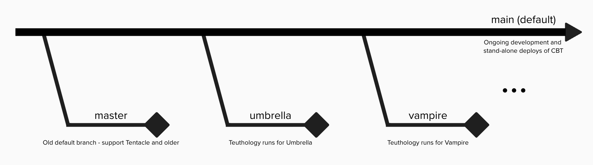

# CBT Release Structure

## Proposal

From Ceph v21.x (Umbrella) onwards, there will be specific 
branches of CBT that tie to each major Ceph release.
Depending on the version of Ceph which teuthology is running 
against, the corresponding branch of CBT will be used.

## Branches
- The `main` branch is the new default branch for ongoing CBT 
development. It is also used for standalone CBT deployments.

- The `master` branch will be retained for backwards compatibility
with older Ceph versions. This branch is frozen and will receive 
no further updates.

- For each new Ceph release, a new CBT branch for that release 
will be created. These branches are exclusively for running
teuthology for a specific Ceph release.

