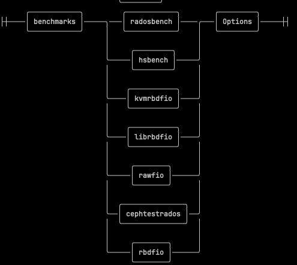

# Test plan schema

A valid test plan .yaml consists of the following compulsory sections at the top level (the level is 
indicated by the indentation in .yaml: the top level has 0 indentation): 

* `cluster` 
* `benchmarks`.

It may also have the following optional sections at the same level: 

* `monitoring_profile`
* `client_endpoints`.

## `cluster`

The cluster section enumerates the components of the Ceph cluster relevant to CBT. There are two 
general classes of components:

* scalars: for example names whose value is a string, a numeric or a boolean;
* collections: components that in turn contain further information, for example profile of pool 
replication.

The following are scalar compulsory entities:
* a head node: this is a string indicating the node that starts the cluster.
* a list of clients, each a string, representing a ssh-reachable host that has a benchmark 
executable installed,
* a list of osds nodes, each of which has at least a running OSD process.

## `benchmarks`

The benchmarks section consists of a non-empty list of collections, each describing a benchmark 
entity.

* A benchmark entity starts with its *name* (second level indentation), valid names are for example: 
`radosbench`, `hsbench`, `kvmrbdfio`, `librbdfio`, etc.

* The contents of the benchmark entity (third level indentation) consist of a collection of items 
(either scalars or collections themselves).  Most of these entities represent options for the 
command line invocation of the benchmark when executed by the clients.

## `monitoring_profiles`

The monitoring_profiles section consists of a non-empty list of of collections, each describing a 
monitoring tool. 

A monitoring entity starts with its name (at second level indentation). Currently supported are `perf`
, `collectl`, `top`.

The contents of the monitoring entity consists of :
* a `nodes` (third level indentation) list of processes to monitor (by default the osd nodes), and 
* an optional string `args` (third level indentation) to indicate the arguments to the monitoring tool.

## `client_endpoints`

The client_endpoints section consists of a non-empty list of collections, each associated to a 
benchmark entity, and typically indicating  the driver for the benchmark. The client_endpoints, if 
specified on a test plan, must be cross referenced by the benchmark section, and as such normally the 
client_endpoints section precedes the benchmarks section in the test plan.

See the dir `example/` for a number of test plan examples.
