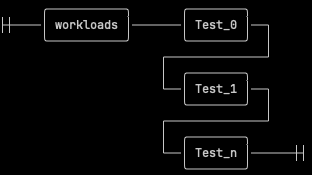

# Workloads

A workload is the specification of a sequence of tests to be executed in the order given.
Typically this involves a *range* of values for a specific benchmark argument. The most used is
the *queue depth*. Depending of the benchmark, this can be expressed as a function of the number
of jobs (or threads, or processes), such that the increase number of these causes a proportional
increase in the I/O. Specifiying workloads in this way permits to generate *response latency curves*
from the results.

The workload feature is currently supported for `librbdfio` only.



* A `workloads`  section is composed by a non-empty collection. Each item in the workload has a free name,
and contains in turn a collection of valid options with values for the benchmark.
* For each of the `iodepth` and `numjobs` options, a range of integer values is permitted.

During execution, any of the given values for the benchmark options in the global section are overwritten
by the given values within the current test workload. The global values are restored once the workload test
completes.

As an example, the following specifies two workloads:

* the first is named  `precondition` and consists of executing a random write over a queue depth of 4,
(that is, the product of numjobs and iodepth), and indicates that monitoring should be disabled during the
execution of the workload,
* the second is named test1, and specifies a random read over the combinatorial of the provided sequences for
the numjobs and iodepth, resp. That is, (1,1), (1,4), (1,8) .. (8,8).


```yaml

workloads:
      precondition:
        jobname: 'precond1rw'
        mode: 'randwrite'
        numjobs: [ 1 ]
        iodepth: [ 4 ]
        monitor: False # whether to run the monitors along the test
      test1:
        jobname: 'rr'
        mode: 'randread'
        numjobs: [ 1, 4, 8 ]
        iodepth: [ 1, 4, 8 ]

```
