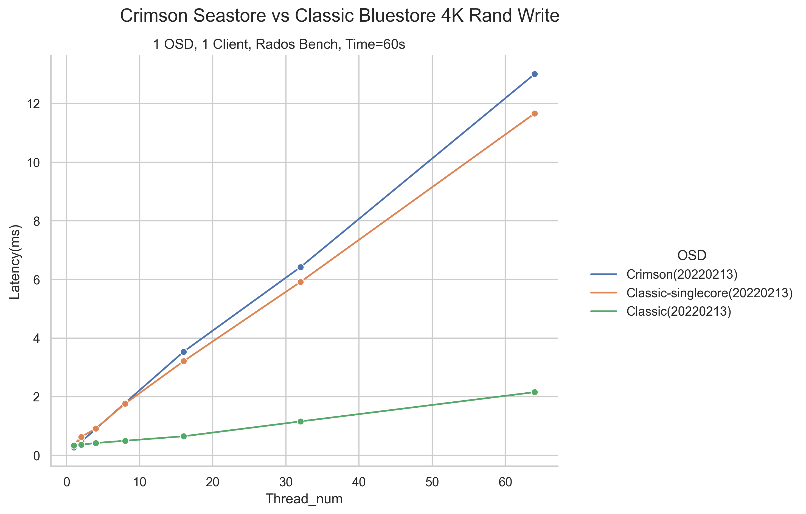

=============
Crimson tools
=============

SeaStore rados bench profiler
=============================

We can profile SeaStore using rados bench with 1 OSD.

To start the test envionment:

.. code-block:: console

     $ MGR=0 MON=1 OSD=1 MDS=0 RGW=0 ../src/vstart.sh -n -x --without-dashboard --seastore --crimson --nodaemon --redirect-output
     $ ./bin/ceph osd pool create test-pool 5 5
     $ ./bin/ceph osd pool set test-pool size 1 --yes-i-really-mean-it

Then run ``seastore_radosbench_run.sh`` to generate workload and collect
metrics.

Finally, run ``seastore_metrics_analyze.py`` to generate diagram from the
collected metrics.

SeaStore fio bench profiler
===========================

We can profile SeaStore using fio bench with 1 OSD.

To start the test envionment:

.. code-block:: console

     $ MGR=0 MON=1 OSD=1 MDS=0 RGW=0 ../src/vstart.sh -n -x --without-dashboard --seastore --crimson --nodaemon --redirect-output

Then run ``seastore_fio_run.sh`` to generate workload and collect
metrics.

Finally, run ``seastore_metrics_analyze.py`` to generate diagram from the
collected metrics.

example rbd_write.fio:

.. code-block:: ini

  [global]
  ioengine=rbd
  clientname=admin
  pool=rbd
  rbdname=fio_test
  rw=randwrite
  bs=4K
  runtime=60
  numjobs=1
  direct=1
  group_reporting

  [rbd_iodepth32]
  iodepth=2

SeaStore metrics profiler
=========================

This is a client-independent and non-stop way to collect metrics for profiling.

Without the client providing the client IO size and number, it assumes the
information from the metrics of committing OBJ_DATA_BLOCK extents.

Since metric files are labeled with time, all the existing plots are changed to
use time as x-axis, and the non-stop way makes it possible to include seastar
metrics correctly.

To start tests, prepare the crimson cluster correctly with seastore, generate
the desired workload, and run ``seastore_metrics_run.sh`` to collect the
metrics.

Finally, run ``seastore_metrics_analyze.py`` to generate plots in png format.

Crimson stress tool
=======================

This is a crimson stress tool for multiple clients and multiple threads 
osd writing test to understand how to stress crimson osd. Users can set the 
number of clients and threads, which kind of test to run (eg. rados bench or 
fio), which processors will bench threads execute on(to avoid test threads 
influencing the result), test time, block size, etc.
Meanwhile, users can set the basic test cases and the clients ratio of each 
type of test case threads running in the same time, for example, 75% of the 
write clients and 25% of the read clients.
Then the tool will integrate IOPS, Bandwidth, Latency, seastar reactor 
utilization, cpu cycle, and other targets to help user analyze 
crimson osd performance.

To use this tool, prepare the python3 environment. You don't need to start a 
ceph cluster because the tool will do that. Put this tool in the ceph build 
directory. Since we will decide which processors the bench threads execute on
, sudo is needed.

Run ``./crimson_stress_tool.py --help`` to get the detail parameter information.

Example:

.. code-block:: console
    
    sudo ./crimson_stress_tool.py \ 
        --client-list 4 8 --thread-list 2 4 6 --taskset 16-31 --time 60 \
        --crimson --store seastore --dev /dev/nvme4n1 \
        --rand-write 0.75 \
        --rand-read 0.25 \
        --reactor-utilization \
        --perf \
        --freq

The tool will run rados bench write and read test case with the combination 
of 4 or 8 clients and 2, 4 or 6 threads. In Every test case, there will be 75% of
write clients in all clients and the read clients will be 25%. Also, you can set
read clients ratio to 0 to do the write only tests, vive versa.
Meanwhile, it will collect the reactor cpu utilization, and the perf information. 
The test thread will run in processors 16~31. In consideration of SeaStore starts 
in processor 0 by default, please avoid setting --taskset to 0.
The tests will run in crimson seastore.

Example of result:

.. code-block:: console
    
               Block_size             4K            4K            4K            4K            4K            4K
                     Time             60            60            60            60            60            60
                     Tool    Rados Bench   Rados Bench   Rados Bench   Rados Bench   Rados Bench   Rados Bench
                  Version       20220213      20220213      20220213      20220213      20220213      20220213
                   OPtype          Mixed         Mixed         Mixed         Mixed         Mixed         Mixed
                      OSD        Crimson       Crimson       Crimson       Crimson       Crimson       Crimson
                    Store       Seastore      Seastore      Seastore      Seastore      Seastore      Seastore
             rw_Bandwidth        12.1087        12.393       12.7304       12.5896       13.1423       12.7655
                  rw_IOPS         3098.0        3171.0        3257.0        3220.0        3361.0        3266.0
               rw_Latency          1.937         3.779         5.520         3.719        7.1285        11.011
             rr_Bandwidth         5.5268        5.7066        6.1939        5.9415        6.6356        7.8256
                  rr_IOPS         1414.0        1460.0        1585.0        1520.0        1698.0        2002.0
               rr_Latency           1.41         2.731         3.779         2.622         4.705         5.983
      Reactor_Utilization          99.59         99.99         99.95         100.0         100.0         99.53
          CPU-Utilization           99.9          99.9          99.9          99.9          99.9          99.9
           CPU_Cycle(GHz)          3.574         3.625         3.609         3.577         3.588         3.591
    Instruction_per_Cycle           0.82          0.83          0.85          0.84          0.86          0.86
          Branches(M/sec)        572.897       591.465       599.812       588.072       605.106       608.871
            Branch-Misses          2.68%         2.62%         2.55%         2.63%         2.57%         2.51%
          Cache-Misses(%)          4.727         5.631         5.750         5.277         5.484         5.641
            CPU_Freq(GHz)          3.605         3.637         3.695          3.63         3.659         3.632
               Thread_num              2             4             6             2             4             6
               Client_num              4             4             4             8             8             8

Crimson stress visualizer
=========================

This is a drawing tool for turn data into visualizations conveniently after
you finish test using stress tool. Common tasks are also supported after
customize the script according to your own needs.

The tool will load data in csv format to Dataframe and will concatenate
the results automatically. Considering data in different scenarios, we
use the args ``--divide`` to distinguish them using the Cartesian Product
of given types.For example, given Block_size(4K, 4M) and OPtype(read, write),
you will get 4 figures with each combination.

Third-party drawing libraries Seaborn and Matplotlib are called in this tool.
pandas.Dataframe is also used to operate data.If you want to change plotting
settings in more detail, go to these websites for more help.

* https://seaborn.pydata.org/
* https://matplotlib.org/
* https://pandas.pydata.org/

Before use, prepare the python3 environment, install the dependencies and see
the help information to start.

* Run ``./crimson_stress_visualizer --help`` to get the detail parameter information.
* Run ``./crimson_stress_visualizer --show-available`` to get the existing tasks and figure types.
* Run ``./crimson_stress_visualizer --task-info`` to get the detail task information.

Existing task:

* "ceph":Common ceph drawing task to compare osd's performance.
* "ceph-bandwidth":Combine client bandwidth and device bandwidth.
* "crimson-utilization":Combine cpu-utilization and reactor-utilization.

Currently, these tasks only support result data with single type of read or write.
Simultaneous different types of operations by stress_tool are not supported.

Example:

.. code-block:: console

    ./crimson_stress_tool.py \
        --thread-list  1 2 4 8 16 32 64 --client-list 1 \
        --taskset=16-31 --block-size 4K --time=60 \
        --rand-write 1 \
        --store bluestore \
        --output classic_randwrite_4K \
        --perf --iostat --freq

    ./crimson_stress_visualizer.py \
        --data classic_randwrite_4K.csv \
        classic_single_randwrite_4K.csv \
        crimson_randwrite_4K.csv \
        --task ceph \
        --fig-type line

After using stress tool, the visualizer will read these three csv outcomes.
The ceph task will generate a figure that indicates the latency in different
threads with the crimson and classic osd. You can add args to ``--task-args``
to change the X, Y, Z variable.

Example of result:

